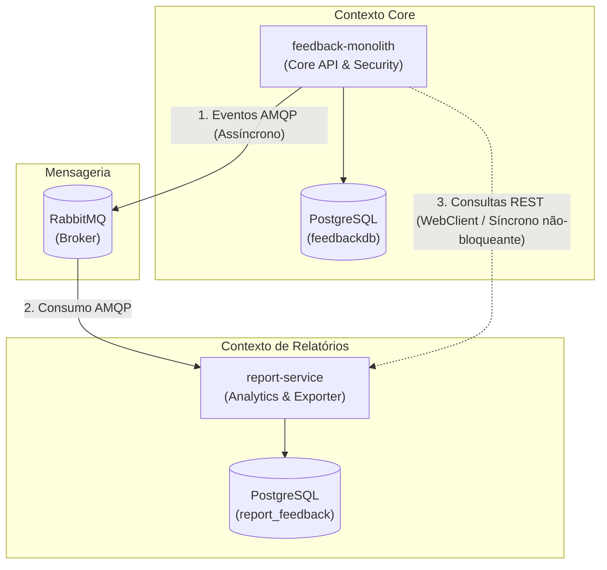

#  Internal Feedback & Analytics — DDD & Microservices 

[](https://www.oracle.com/java/)
[](https://spring.io/projects/spring-boot)
[](https://www.rabbitmq.com/)
[](https://www.postgresql.org/)
[](https://www.docker.com/)

Projeto acadêmico desenvolvido para demonstrar a aplicação de **Domain-Driven Design (DDD)** e a transição pragmática de uma arquitetura **Monolítica** para uma **Arquitetura Orientada a Eventos (EDA)** baseada em **Microsserviços**.

[Monolito Original](https://github.com/gvieira1/feedback-system-api)

---

##  Contexto de Negócio & Visão de DDD

A aplicação atende à gestão de clima organizacional de uma empresa, permitindo a coleta e gestão de feedbacks internos de funcionários (anônimos ou identificados) direcionados a setores específicos, com acesso restrito a administradores (RH).

### Separação de Contextos Delimitados (*Bounded Contexts*)
A arquitetura foi modelada aplicando padrões estratégicos de DDD:

1. **Contexto Core (`feedback-monolith`):**
   - **Responsabilidade:** Autenticação, gestão de usuários, cadastro de feedbacks e controle de acesso sensível.
   - **Agregados:** `User`, `Feedback`.
   - **Garantias:** Regra estrita de confidencialidade (anonimato garantido em nível de aplicação e banco).

2. **Contexto de Inteligência Analítica (`report-service`):**
   - **Responsabilidade:** Consolidação de métricas, agrupamento por tipo (`ELOGIO`, `SUGESTÃO`, `CRÍTICA`, `RECLAMAÇÃO`) e geração de relatórios/exportações (CSV/JSON).
   - **Motivação do Destaque:** 
	1. **Linguagem Ubíqua & Atores Distintos:** O contexto operacional atende ao funcionário na escrita de feedbacks, enquanto o analítico serve à administração com vocabulário focado em tomada de decisão.
	2. **Segregação Leitura/Escrita (CQRS/CQS):** Isola as regras de negócio transacionais pesadas (*Write Model*) das consultas e agregações analíticas de leitura (*Read Model*).
	3. **Autonomia & Baixo Acoplamento:** Permite ao serviço de relatórios evoluir consultas e formatos de exportação de forma independente, sem impactar a disponibilidade e latência do fluxo principal de envios.

---

## Evolução Arquitetural & Comunicação Híbrida

O projeto evoluiu de uma API  monolítica para uma estrutura desacoplada em **Monorepo**:



### Decisões Arquiteturais de Destaque

- **Database-per-Service:** Isolamento completo de dados entre as bases `feedbackdb` e `report_feedback`.
    
- **Event-Driven Assíncrono:** As alterações de feedbacks publicam eventos no **RabbitMQ**, garantindo que o processamento analítico ocorra de forma assíncrona e resiliente.
    
- **Consultas Síncronas Não-Bloqueantes:** A comunicação HTTP direta do Monolito para o Microsserviço utiliza `WebClient` reativo.
    
- **Zero-Trust Interno:** O microsserviço de relatórios possui o `SecurityConfig` fechado (`anyRequest().authenticated()`), exigindo repasse de Token JWT para qualquer requisição HTTP.

##  Histórias de Usuário Implementadas

- **🔐 Autenticação & Autorização :** Cadastro e login de usuários com emissão de token JWT RSA. Diferenciação de permissões entre `EMPLOYEE` e `ADMIN`.
    
- **🗣️ Gestão de Feedbacks:** Envio de feedbacks anônimos/identificados. Omissão estrita do autor em feedbacks anônimos.
    
- **📊 Relatórios & Moderação:** Administradores consultam feedbacks filtrados por setor e data, realizam moderação (exclusão) e agrupam por tipo.
    
- **📁 Exportação de Dados:** Exportação em lote para formato CSV.

## Tech Stack & Engenharia

- **Linguagem & Framework:** Java 21 LTS, Spring Boot 3, Spring Security (OAuth2 Resource Server), Spring Data JPA.
    
- **Mensageria & Banco de Dados:** RabbitMQ (AMQP), PostgreSQL 16.
      
- **DevOps :** Docker, Docker Compose.
    
##  Como Executar o Ambiente Completo

### - Pré-requisitos

- Docker e Docker Compose instalados.
    
### - Passos

1. **Clonar o Repositório:**


    ```Bash
    git clone https://github.com/gvieira1/feedback-microservice.git
    cd feedback-microservice
    ```
    
1. **Configurar o Arquivo de Variáveis de Ambiente:**


    ```Bash
    cp .env.example .env
    ```
    
2. **Subir os Containers :**
    
      
    
    
    
    ```Bash
    docker compose up --build -d
    ```
    

## Endpoints & Documentação

Toda a documentação OpenAPI/Swagger foi **centralizada no Monolito**, que atua como ponto único de entrada para clientes externos:

  

- **Swagger UI (API Core):** [http://localhost:8080/swagger-ui.html](http://localhost:8080/swagger-ui.html)
    
      
    
- **Painel RabbitMQ:** [http://localhost:15672](http://localhost:15672) _(guest / guest)_
    
      
    

